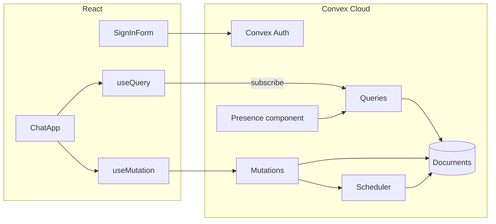

# Architecture (this Convex implementation)

How **convex-chat** implements [PRODUCT.md](./PRODUCT.md). Use this to understand the code in this repo. A port should copy **behavior**, not these APIs.

## Runtime

```
Browser (Vite, :5173)
  └─ WebSocket / HTTP `/api` (Vite proxy)
        ├─ Convex Cloud (`npm run dev`, after `deployment select dev`)
        └─ Local CLI backend :3210 / :3211 (`npm run dev:local`)
                    ├─ document DB (channels, messages, typing, auth tables)
                    ├─ query/mutation functions in convex/
                    ├─ scheduler (typing expiry)
                    └─ @convex-dev/presence component (heartbeats, rooms)
```

- Frontend: Vite + React 19 + TypeScript + Tailwind v4 + shadcn/ui
- Auth: `@convex-dev/auth` Password provider
- Generated types: `convex/_generated/` (do not hand-edit; `npx convex dev` rewrites them)

`npm run dev` runs Vite and `convex dev` together against the selected deployment. `npm run dev:local` selects a local CLI backend and starts Vite via `convex dev --start`. `VITE_CONVEX_URL` is written to `.env.local`. In Vite dev the client connects to `window.location.origin`; the proxy forwards `/api` to that URL.

## Convex primitives (map these when porting)

| Convex | Meaning | Port equivalent |
| --- | --- | --- |
| `query` + `useQuery` | Server read + live subscription | Live query, websocket, or SSE; `undefined` while loading |
| `mutation` + `useMutation` | Transactional write | Authenticated write that notifies subscribers |
| `internalMutation` + `scheduler` | Delayed server job | TTL, expiry job, or timeout on typing rows |
| Component (`presence`) | Isolated tables + functions | Presence service or table + heartbeat |
| `authTables` / Convex Auth | Users, sessions, password hashes | Your auth (sessions + hashed passwords) |

There are **no HTTP REST handlers** for chat. The client calls typed functions (`api.messages.send`). HTTP in `convex/http.ts` exists only for Convex Auth.

**Actions** (outbound HTTP) are unused.

The app schema is **not** a SQL schema you can query. Postgres/MySQL, if used by Cloud or self-hosting, is an opaque persistence layer.

## File map

| File | Responsibility |
| --- | --- |
| `convex/schema.ts` | `authTables` + `channels` / `messages` / `typing` + indexes |
| `convex/auth.ts` | Password provider; sign-up writes `users.name` |
| `convex/auth.config.ts` | JWT issuer (`CONVEX_SITE_URL`) |
| `convex/http.ts` | Auth HTTP routes |
| `convex/convex.config.ts` | Registers `@convex-dev/presence` |
| `convex/lib/auth.ts` | `requireUserId` for writes |
| `convex/users.ts` | `viewer` — current user document |
| `convex/channels.ts` | `list`, `ensureGeneral`, `create` |
| `convex/messages.ts` | `list` (join author name), `send`, `removeOwn` |
| `convex/typing.ts` | `list`, `upsert`, `clear`, `clearIfStale` |
| `convex/presence.ts` | `heartbeat`, `list` (join name/image), `disconnect` |
| `src/main.tsx` | `ConvexAuthProvider` + `ConvexReactClient` |
| `src/App.tsx` | `AuthLoading` / `Unauthenticated` / `Authenticated` |
| `src/components/SignInForm.tsx` | Password form → `signIn("password", formData)` |
| `src/components/ChatApp.tsx` | Layout, `ensureGeneral`, selected `channelId` |
| `src/components/ChannelList.tsx` | Sidebar + create |
| `src/components/MessageList.tsx` | Live thread + delete own |
| `src/components/MessageInput.tsx` | Send + 300ms typing debounce |
| `src/components/TypingIndicator.tsx` | Filter self; format names |
| `src/components/PresencePile.tsx` | `usePresence(api.presence, roomId, userId)` |

## Data flow



`useQuery` returns `undefined` until the first snapshot. Do not coalesce that to `[]` or the UI will flash an empty state.

## Function contracts

Public functions are the product API. Names are `api.<file>.<export>`.

### `users.viewer` (query)

No args. Returns the `users` document or `null`.

### `channels.list` (query)

No args. Signed-out → `[]`. Else all channels, `general` first, then `name` ascending.

### `channels.ensureGeneral` (mutation)

Auth required. Inserts `{ name: "general", createdBy }` if missing. Returns channel id.

### `channels.create` (mutation)

Args: `{ name: string }`. Auth required. Normalizes and validates (see PRODUCT.md). Returns existing or new id.

### `messages.list` (query)

Args: `{ channelId }`. Signed-out → `[]`. Else up to 50 messages, oldest first, each with `authorName`.

### `messages.send` (mutation)

Args: `{ channelId, body }`. Auth required. Validates and inserts.

### `messages.removeOwn` (mutation)

Args: `{ messageId }`. Auth required. Deletes if caller is author.

### `typing.list` (query)

Args: `{ channelId }`. Returns `{ userId, name }[]` for everyone typing (client hides self).

### `typing.upsert` / `typing.clear` (mutations)

Args: `{ channelId }`. Auth required. Upsert schedules `typing.clearIfStale` in 3000ms with the current `updatedAt`.

### `presence.heartbeat` / `list` / `disconnect`

Used by `usePresence`. Heartbeat `userId` must equal the authenticated user. `list` is keyed by `roomToken` (not viewer id) so all clients in a room share a cache. `disconnect` has no auth (sendBeacon).

## Indexes

| Table | Index | Fields |
| --- | --- | --- |
| `channels` | `by_name` | `name` |
| `messages` | `by_channel` | `channelId` |
| `typing` | `by_channel` | `channelId` |
| `typing` | `by_channel_and_user` | `channelId`, `userId` |

Auth tables and their indexes come from `authTables`.

## Auth details specific to this stack

- Form fields: `email`, `password`, `flow` (`signIn` \| `signUp`), `name` on sign-up
- JWT env: `JWT_PRIVATE_KEY`, `JWKS`, `SITE_URL=http://localhost:5173` on the deployment
- `npx @convex-dev/auth` configures those env vars; the CLI does not support self-hosted Auth setup

## What not to copy blindly

- `api` / `useQuery` names
- Convex document `_id` / `_creationTime`
- Presence `roomToken` / `sessionToken`
- The word “Convex” in UI copy, except the product title **Convex Chat** if you want visual parity
